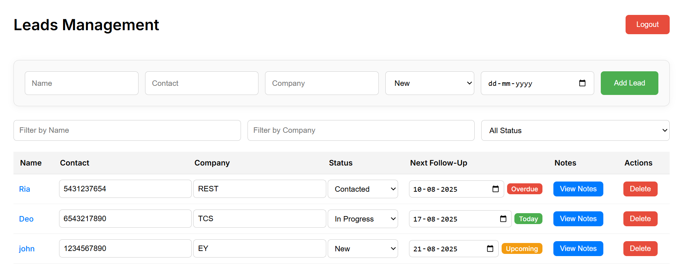
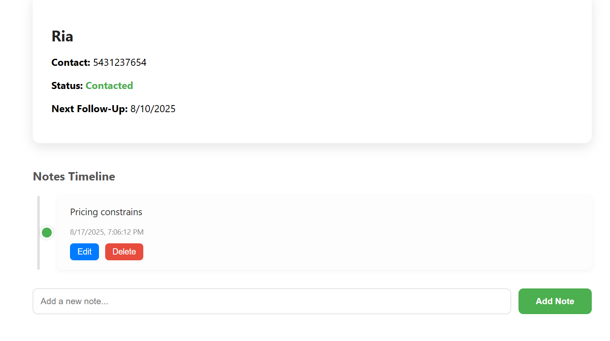
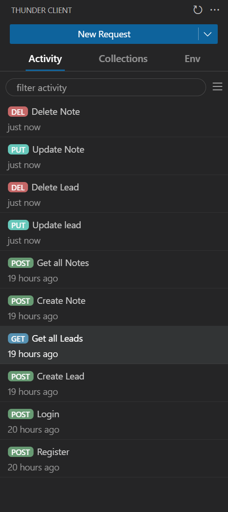

# Leads Management Frontend

React frontend for managing leads and notes.

---

## Setup

1. Clone repo:

```bash
git clone <repo-url>
cd <frontend-folder>
```

2. Install dependencies:

```bash
npm install
```

3. Run dev server:

```bash
npm start
```

Open [http://localhost:3000](http://localhost:3000)

---

## Folder Structure

```
src/
├─ api/           # Axios API calls
├─ components/    # Reusable components
├─ pages/         # HomePage, LoginPage, RegisterPage, LeadsPage, LeadDetailPage
├─ App.js         # Routes
└─ index.js       # Entry point
```

---

## Pages

* **HomePage** – Landing page
* **LoginPage / RegisterPage** – Auth
* **LeadsPage** – View, filter, create, update, delete leads

* **LeadDetailPage** – Lead info + notes management


---

## Features

* Leads CRUD
* Notes CRUD
* Filters by name, company, status

## Backen github url

```bash
https://github.com/Ruchitha1608/CRM-backend.git
```


Here’s a concise backend README including the CRUD APIs:

---

# Leads Management Backend

Node.js + Express backend for managing leads and notes.

---

## Setup & Run

```bash
npm install
npm start
```

API runs on **[http://localhost:5000](http://localhost:5000)** by default.

---

## API Endpoints (CRUD)

### Auth

* **POST /auth/register** – Register user
* **POST /auth/login** – Login user

### Leads

* **GET /leads** – Get all leads
* **POST /leads** – Create a new lead
* **GET /leads/\:id** – Get lead by ID
* **PUT /leads/\:id** – Update lead
* **DELETE /leads/\:id** – Delete lead

### Notes

* **GET /leads/\:id/notes** – Get notes for a lead
* **POST /leads/\:id/notes** – Add note to a lead
* **PUT /leads/\:id/notes/\:noteId** – Update note
* **DELETE /leads/\:id/notes/\:noteId** – Delete note

---


## Folder Structure

```
src/
├─ controllers/   # Request handlers
├─models/         # DB models (e.g., Prisma)
├─ routes/        # API routes
├─ middleware/    # Auth & error handling
├─ utils/         # Helper functions
├─ app.js         # Express app
└─ server.js      # Server start
```

---
